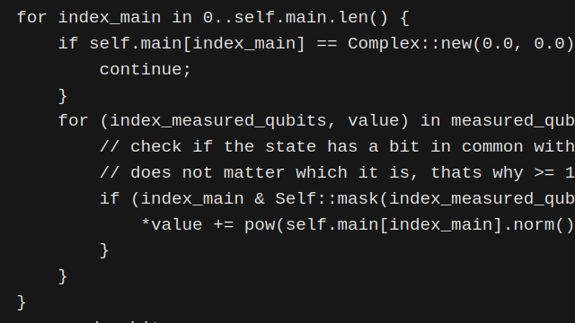

## AI Not So Intelligent

This is my revolutionary post.  
Here is some Rust code to annoy some people.

```rust
/// Returns the results of the operations performed in the `QubitLayer`.  
/// Equivalent to collapsing qubits to obtain its state.
/// # Examples
/// ```
/// use quantum_state_sim::{QubitLayer, QuantumOp};
///
/// let mut q_layer = QubitLayer::new(20);
/// q_layer.execute(vec![(QuantumOp::Hadamard, 0)]);
/// println!("{:?}", q_layer.measure_qubits());
///
/// ```
#[must_use]
pub fn measure_qubits(&self) -> MeasuredQubits {
    let num_qubits = self.get_num_qubits();
    let mut measured_qubits: Vec<f64> = vec![0.0; num_qubits as usize];

    for index_main in 0..self.main.len() {
        if self.main[index_main] == Complex::new(0.0, 0.0) {
            continue;
        }
        for (index_measured_qubits, value) in measured_qubits.iter_mut().enumerate() {
            // check if the state has a bit in common with the measured_qubit index
            // does not matter which it is, thats why >= 1
            if (index_main & Self::mask(index_measured_qubits)) > 0 {
                *value += pow(self.main[index_main].norm(), 2);
            }
        }
    }
    measured_qubits
}
```

## And a picture of more Rust code


Fin.  
Luis
