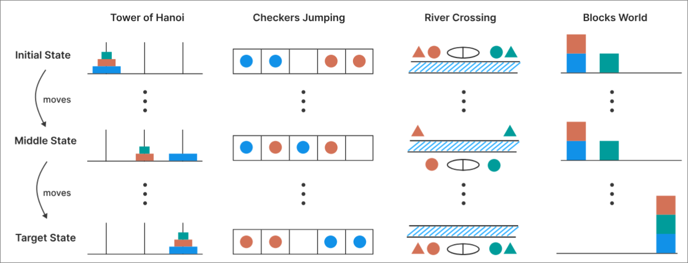
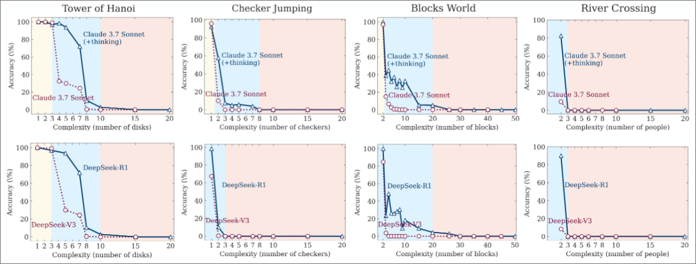
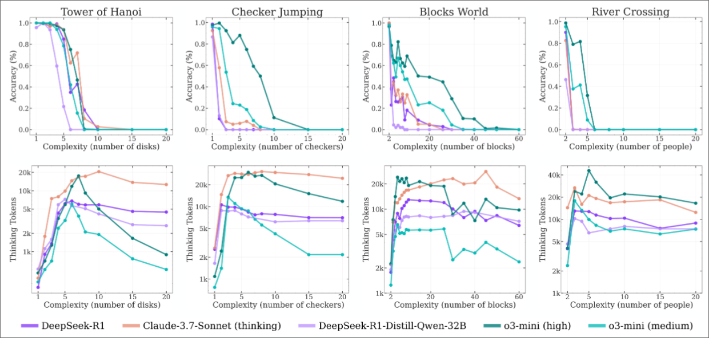

## Understanding the Strengths and Limitations of Reasoning Models via the Lens of Problem Complexity

[Article Link](https://arxiv.org/abs/2506.06941v1)

This is a paper from Apple's machine learning researchers.  
It mainly challenges the gap in LLM testing. Most of the benchmarks used to evaluate LLM's use "established mathematical and coding benchmarks, emphasizing final answer accuracy", these are not useful to truly evaluate the true capability of solving complex problems, also due to data contamination. Data contamination is the inclusion of evaluation data in the training data.  

This is why the authors define certain benchmarks based on problem solving and with variable complexity so that is possible to quantify the reasoning ability of LLM's.  

The authors also compare LRM's (Large Reasoning Models) with LLM's. Due to the popularity of DeepSeek, models that also express their "thinking" ability gained some notoriety. Both are compared in the authors benchmarks to see if LRM's unique nature present some advantage compared to standard LLM's.

These are my key take aways:
> "Notably, near this collapse point, LRMs begin reducing their reasoning effort (measured by inference-time tokens) as problem complexity increases, despite operating well below generation length limits"  

> "This suggests a fundamental inference time scaling limitation in LRMs’ reasoning capabilities relative to problem complexity."

> "At moderate complexity, correct solutions emerge only after extensive exploration of incorrect paths. Beyond a certain complexity threshold, models completely fail to find correct solutions (Fig. 1, bottom right). This indicates LRMs possess limited self-correction capabilities that, while valuable, reveal fundamental inefficiencies and clear scaling limitations."

The benchmarks:
- Tower of Hanoi
- Checker Jumping
- River Crossing
- Blocks World
  

*Benchmarks*

*Accuracy of LRM's compared to LLM's*  

The authors also found a clear limitation of thinking models - despite operating well below their generation length limits, these models fail to take advantage of their additional inference compute during the thinking phase as problems become more complex, suggesting a clear limitation of "thinking" capabilities. The thinking tokens increase proportionally with problem complexity up to a critical point, where the accuracy collapse and, counterintutively, the reasoning effort begins to reduce with problem complexity.   

*LRM's accuracy collapse with increasing problem complexity*  

### Failure to follow logic steps in prompt  
> "In the Tower of Hanoi environment, even when we provide the algorithm in the prompt—so that the model only needs to execute the prescribed steps—performance does not improve, and the observed collapse still occurs at roughly the same point."  

### An interesting note on data contamination  
> "Note that this model also achieves near-perfect accuracy when solving the Tower of Hanoi with (N=5), which requires 31 moves, while it fails to solve the River Crossing puzzle when (N=3), which has a solution of 11 moves. This likely suggests that examples of River Crossing with N>2 are scarce on the web, meaning LRMs may not have frequently encountered or memorized such instances during training."  

### Opinion  
When a considerable amount of people fear the replacement of human jobs by LLM's, these still have some trouble to solve logic based problems. It feels to me that there will always be an inherit limitation to classical computing ability to deeply resemble human ability. It seems another example where computing is great at performing repetitive tasks that do not depend on deep logic and creativity. This only means that by using these auxiliary tools, human jobs will depend more on what makes humans unique, deep logic and creativity. That can only be a better future for us.  

What more makes humans unique?  

It is still unclear to me what are the problems that LLM's are really good at. For now, to me it seems they are really good to summarize data in human language. The answers are bad if the data is bad, but when training these models in reliable and specific sources of data, the output is really useful. To me it seems the best use cases of LLM's:
- "Pretend you are the author of this article. Answer my questions based on this uploaded article."
- "Based on the Portuguese Constitution, tell me if this proposed law violates the Constitution. Present references of the Constitution document that underlie your answer."  

